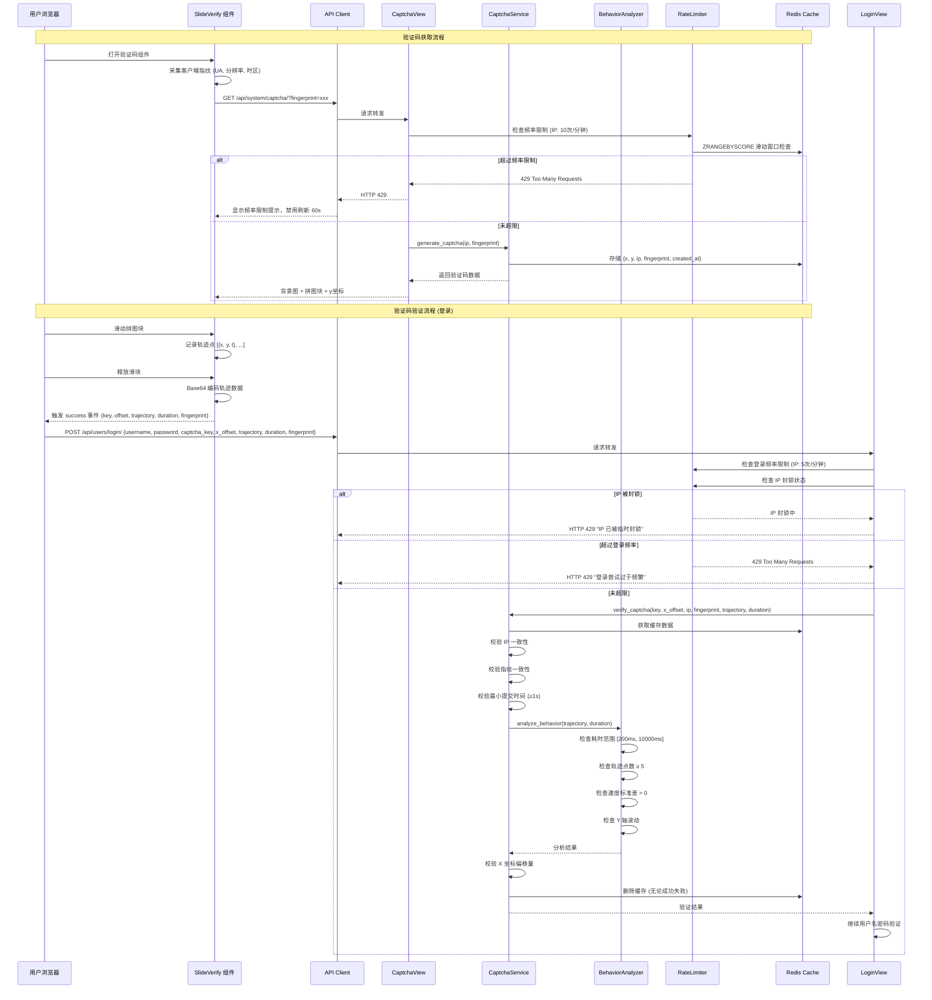

# 设计文档：滑动验证码增强（防机器人 & 防爬虫）

## 概述

本设计文档描述了对现有滑动验证码系统的全面安全增强方案。系统基于 Django REST Framework 后端 + Vue.js 前端的全栈架构，使用 Redis 作为缓存和速率限制的存储后端。

增强方案覆盖以下核心领域：
1. **滑动轨迹采集与行为分析** — 前端采集用户滑动轨迹，后端分析行为模式以区分人类与机器人
2. **频率限制** — 基于 Redis 滑动窗口算法，对验证码获取和登录接口实施速率限制与 IP 封锁
3. **验证码安全加固** — 一次性验证、缩短有效期、IP 绑定、最小提交时间间隔
4. **客户端指纹** — 采集浏览器环境信息生成指纹哈希，绑定验证码生命周期
5. **图片增强** — 增加干扰线、噪点和高斯模糊，提高图像识别破解难度
6. **前端安全增强** — 移除前端简单判断、轨迹数据 Base64 编码、429 状态码处理

### 设计决策

- **速率限制实现方式**：使用自定义 Redis 滑动窗口算法而非 `django-ratelimit` 第三方库，因为项目已有 `django-redis` 依赖，且需要灵活控制 IP 封锁逻辑（30 分钟内累计 15 次失败封锁 30 分钟），第三方库难以满足此需求。
- **行为分析位置**：行为分析逻辑放在 `CaptchaService` 内部作为独立方法，而非独立模块，因为它与验证码验证流程紧密耦合。
- **客户端指纹方案**：使用纯 JavaScript 采集 User-Agent、屏幕分辨率、时区偏移量并通过 SHA-256 生成哈希，不引入 FingerprintJS 等第三方库，保持轻量。
- **前端不引入新依赖**：所有前端增强均使用原生 API 实现（`SubtleCrypto` 用于 SHA-256，`btoa` 用于 Base64），不增加 `package.json` 依赖。

## 架构

### 整体架构图



### 模块结构

```
backend/
├── apps/system/
│   ├── services/
│   │   └── captcha.py          # CaptchaService (增强) + BehaviorAnalyzer (新增)
│   ├── rate_limiter.py         # RateLimiter (新增)
│   └── views.py                # CaptchaView (增强)
├── apps/users/
│   └── views.py                # LoginView (增强)

frontend/
├── src/components/SlideVerify/
│   └── index.vue               # SlideVerify 组件 (增强)
├── src/api/
│   ├── system.ts               # getCaptcha API (增强)
│   └── user.ts                 # login API (增强)
├── src/views/
│   └── Login.vue               # 登录页 (增强)
```

## 组件与接口

### 1. BehaviorAnalyzer（新增）

位于 `backend/apps/system/services/captcha.py`，作为独立类。

```python
class BehaviorAnalyzer:
    """滑动行为分析器"""
    
    MIN_DURATION = 200       # 最小滑动耗时 (ms)
    MAX_DURATION = 10000     # 最大滑动耗时 (ms)
    MIN_TRACK_POINTS = 5     # 最少轨迹点数
    
    @staticmethod
    def analyze(trajectory: list[dict], duration: int) -> tuple[bool, str]:
        """
        分析滑动行为是否为人类操作
        :param trajectory: 轨迹点列表 [{x, y, t}, ...]
        :param duration: 滑动总耗时 (ms)
        :return: (是否通过, 错误消息)
        """
    
    @staticmethod
    def _check_duration(duration: int) -> bool:
        """检查滑动耗时是否在合理范围"""
    
    @staticmethod
    def _check_track_count(trajectory: list[dict]) -> bool:
        """检查轨迹点数量"""
    
    @staticmethod
    def _check_speed_variance(trajectory: list[dict]) -> bool:
        """检查速度标准差（是否存在加速减速变化）"""
    
    @staticmethod
    def _check_y_fluctuation(trajectory: list[dict]) -> bool:
        """检查 Y 坐标是否存在微小波动"""
```

### 2. RateLimiter（新增）

位于 `backend/apps/system/rate_limiter.py`。

```python
class RateLimiter:
    """基于 Redis 滑动窗口的速率限制器"""
    
    @staticmethod
    def is_rate_limited(key: str, max_requests: int, window_seconds: int) -> bool:
        """
        检查是否超过速率限制（滑动窗口算法）
        :param key: 限制键 (如 "captcha:rate:{ip}")
        :param max_requests: 窗口内最大请求数
        :param window_seconds: 窗口大小 (秒)
        :return: True 表示已超限
        """
    
    @staticmethod
    def record_login_failure(ip: str) -> None:
        """记录登录失败次数"""
    
    @staticmethod
    def is_ip_blocked(ip: str) -> bool:
        """检查 IP 是否被封锁（30分钟内累计15次失败）"""
    
    @staticmethod
    def get_client_ip(request) -> str:
        """从请求中提取客户端 IP"""
```

### 3. CaptchaService（增强）

在现有 `backend/apps/system/services/captcha.py` 基础上增强。

接口变更：

| 方法 | 变更 | 说明 |
|------|------|------|
| `generate_captcha(ip, fingerprint)` | 新增参数 | 绑定 IP 和客户端指纹 |
| `verify_captcha(key, x_offset, ip, fingerprint, trajectory, duration)` | 新增参数 | 增加 IP/指纹校验、行为分析 |
| `create_background()` | 增强 | 添加干扰线、增加噪点、高斯模糊 |
| `CAPTCHA_EXPIRE` | 修改 | 从 300s 改为 120s |

缓存数据结构变更：

```python
# 旧格式
cache.set(f'captcha:{key}', {'x': x, 'y': y}, 300)

# 新格式
cache.set(f'captcha:{key}', {
    'x': x,
    'y': y,
    'ip': client_ip,
    'fingerprint': client_fingerprint,
    'created_at': timestamp  # time.time()
}, 120)
```

### 4. CaptchaView（增强）

GET 接口增加频率限制和指纹参数接收：

```python
class CaptchaView(APIView):
    permission_classes = [AllowAny]
    
    def get(self, request):
        # 1. 频率限制检查
        # 2. 获取客户端 IP 和指纹
        # 3. 调用 CaptchaService.generate_captcha(ip, fingerprint)
```

### 5. LoginView（增强）

POST 接口增加频率限制、IP 封锁检查和增强验证参数：

```python
class LoginView(APIView):
    permission_classes = [AllowAny]
    
    def post(self, request):
        # 1. IP 封锁检查
        # 2. 登录频率限制检查
        # 3. 增强验证码校验 (含轨迹、指纹)
        # 4. 用户名密码验证
        # 5. 登录失败时记录失败次数
```

### 6. SlideVerify 组件（增强）

事件接口变更：

```typescript
// 旧接口
emit('success', captchaKey: string, xOffset: number)

// 新接口
emit('success', data: {
  captchaKey: string
  xOffset: number
  trajectory: string      // Base64 编码的轨迹数据
  duration: number         // 滑动总耗时 (ms)
  fingerprint: string      // 客户端指纹哈希
})
```

### 7. API 接口变更

**GET /api/system/captcha/**

请求参数（Query）：
```
fingerprint: string  // 客户端指纹哈希
```

响应（新增 429 状态码）：
```json
// 429 Too Many Requests
{ "code": 429, "message": "请求过于频繁，请稍后再试" }
```

**POST /api/users/login/**

请求体变更：
```json
{
  "username": "string",
  "password": "string",
  "captcha_key": "string",
  "x_offset": 0,
  "trajectory": "base64_encoded_string",
  "duration": 0,
  "fingerprint": "string"
}
```

响应（新增 429 状态码）：
```json
// 429 - 频率限制
{ "code": 429, "message": "登录尝试过于频繁，请 1 分钟后再试" }
// 429 - IP 封锁
{ "code": 429, "message": "您的 IP 已被临时封锁，请 30 分钟后再试" }
```


## 数据模型

### Redis 缓存键设计

| 缓存键 | 用途 | TTL | 数据结构 |
|--------|------|-----|----------|
| `captcha:{key}` | 验证码答案及绑定信息 | 120s | `{x, y, ip, fingerprint, created_at}` |
| `rate:captcha:{ip}` | 验证码获取频率计数 | 60s | Sorted Set (时间戳作为 score) |
| `rate:login:{ip}` | 登录频率计数 | 60s | Sorted Set (时间戳作为 score) |
| `login:fail:{ip}` | 登录失败累计计数 | 1800s (30min) | Sorted Set (时间戳作为 score) |
| `login:block:{ip}` | IP 封锁标记 | 1800s (30min) | 简单字符串 "1" |

### 滑动窗口算法说明

使用 Redis Sorted Set 实现滑动窗口：

```python
# 伪代码
def is_rate_limited(key, max_requests, window_seconds):
    now = time.time()
    window_start = now - window_seconds
    
    pipe = redis.pipeline()
    pipe.zremrangebyscore(key, 0, window_start)  # 清除过期记录
    pipe.zadd(key, {unique_id: now})              # 添加当前请求
    pipe.zcard(key)                                # 计算窗口内请求数
    pipe.expire(key, window_seconds)               # 设置键过期
    results = pipe.execute()
    
    return results[2] > max_requests
```

### 轨迹数据格式

前端采集的轨迹数据结构：

```typescript
interface TrackPoint {
  x: number    // X 坐标 (相对于滑块起始位置)
  y: number    // Y 坐标 (相对于滑块起始位置)
  t: number    // 时间戳 (相对于滑动开始时间, ms)
}

// 提交时 Base64 编码: btoa(JSON.stringify(trackPoints))
```

### 客户端指纹数据

```typescript
interface FingerprintData {
  userAgent: string          // navigator.userAgent
  screenResolution: string   // `${screen.width}x${screen.height}`
  timezoneOffset: number     // new Date().getTimezoneOffset()
}

// 指纹哈希: SHA-256(JSON.stringify(fingerprintData))
```


## 正确性属性

*属性（Property）是指在系统所有合法执行路径中都应保持为真的特征或行为——本质上是对系统应做什么的形式化陈述。属性是人类可读规格说明与机器可验证正确性保证之间的桥梁。*

### Property 1: 行为分析器拒绝异常耗时

*For any* 滑动耗时 duration，如果 duration < 200 或 duration > 10000（毫秒），则 BehaviorAnalyzer.analyze() 应返回 (False, "行为异常")。

**Validates: Requirements 2.1, 2.5**

### Property 2: 行为分析器拒绝轨迹点不足

*For any* 轨迹数据 trajectory，如果 len(trajectory) < 5，则 BehaviorAnalyzer.analyze() 应返回 (False, "行为异常")。

**Validates: Requirements 2.2, 2.5**

### Property 3: 行为分析器拒绝匀速滑动

*For any* 轨迹数据 trajectory（轨迹点 ≥ 5 且耗时在合理范围内），如果所有相邻轨迹点的 X 方向速度完全相同（标准差为 0），则 BehaviorAnalyzer.analyze() 应返回 (False, "行为异常")。

**Validates: Requirements 2.3, 2.5**

### Property 4: 行为分析器拒绝 Y 轴恒定轨迹

*For any* 轨迹数据 trajectory（轨迹点 ≥ 5 且耗时在合理范围内），如果所有轨迹点的 Y 坐标完全相同，则 BehaviorAnalyzer.analyze() 应返回 (False, "行为异常")。

**Validates: Requirements 2.4, 2.5**

### Property 5: 滑动窗口速率限制

*For any* IP 地址和速率限制配置 (max_requests, window_seconds)，在窗口时间内发送 max_requests 次请求后，第 max_requests + 1 次请求应被 RateLimiter 拒绝（返回 True 表示已超限）。

**Validates: Requirements 3.1, 3.3, 4.1**

### Property 6: IP 封锁机制

*For any* IP 地址，在 30 分钟内累计记录 15 次登录失败后，is_ip_blocked() 应返回 True，且在封锁期间所有后续登录请求应被拒绝。

**Validates: Requirements 4.3, 4.4**

### Property 7: 验证码一次性使用

*For any* 验证码 captcha_key，无论首次验证成功或失败，第二次使用相同 captcha_key 调用 verify_captcha() 应返回 (False, "验证码已过期，请重新获取")。

**Validates: Requirements 5.1**

### Property 8: 验证码绑定校验

*For any* 验证码 captcha_key，如果验证时提交的 IP 地址或客户端指纹与生成时不一致，verify_captcha() 应返回验证失败。具体地：IP 不一致时返回验证失败，指纹不一致时返回 (False, "客户端环境异常")。

**Validates: Requirements 5.3, 6.3, 6.4**

### Property 9: 验证码最小提交时间间隔

*For any* 验证码 captcha_key，如果从生成到验证的时间间隔小于 1 秒，verify_captcha() 应返回验证失败。

**Validates: Requirements 5.4**

### Property 10: 客户端指纹确定性

*For any* 相同的浏览器环境信息（User-Agent、屏幕分辨率、时区偏移量），生成的指纹哈希值应始终相同；对于不同的环境信息，生成的指纹哈希值应不同。

**Validates: Requirements 6.1**

### Property 11: 轨迹数据 Base64 编码往返

*For any* 合法的轨迹数据数组 trajectory，对其进行 Base64 编码后再解码，应得到与原始数据完全相同的结果。

**Validates: Requirements 8.2**

### Property 12: 前端不过滤验证结果

*For any* xOffset 值（包括 ≤ 30 的值），SlideVerify 组件在用户释放滑块后应始终将验证数据提交给后端，不进行客户端侧的过滤或拒绝。

**Validates: Requirements 8.1**

### Property 13: 轨迹点结构完整性

*For any* 用户滑动操作产生的轨迹点，每个轨迹点必须包含 x（X 坐标）、y（Y 坐标）和 t（相对时间戳）三个字段，且 t 值单调递增。

**Validates: Requirements 1.1**

## 错误处理

### 后端错误处理

| 场景 | HTTP 状态码 | 错误消息 | 处理方式 |
|------|------------|----------|----------|
| 验证码获取频率超限 | 429 | "请求过于频繁，请稍后再试" | RateLimiter 在 CaptchaView 中拦截 |
| 登录频率超限 | 429 | "登录尝试过于频繁，请 1 分钟后再试" | RateLimiter 在 LoginView 中拦截 |
| IP 被封锁 | 429 | "您的 IP 已被临时封锁，请 30 分钟后再试" | RateLimiter 在 LoginView 中拦截 |
| 验证码过期/不存在 | 400 | "验证码已过期，请重新获取" | CaptchaService.verify_captcha |
| 验证码 IP 不匹配 | 400 | "验证失败，请重试" | CaptchaService.verify_captcha |
| 客户端指纹不匹配 | 400 | "客户端环境异常" | CaptchaService.verify_captcha |
| 提交过快（< 1s） | 400 | "验证失败，请重试" | CaptchaService.verify_captcha |
| 行为分析不通过 | 400 | "行为异常" | BehaviorAnalyzer.analyze |
| X 坐标偏移不正确 | 400 | "验证失败，请重试" | CaptchaService.verify_captcha |
| 轨迹数据缺失 | 400 | "请完成滑动验证" | LoginView 参数校验 |
| Redis 连接失败 | 500 | "生成验证码失败: ..." | CaptchaView 异常捕获，降级为允许通过 |

### 前端错误处理

| 场景 | 处理方式 |
|------|----------|
| 验证码获取返回 429 | 显示"请求过于频繁，请稍后再试"提示，禁用刷新按钮 60 秒 |
| 验证码获取网络错误 | 显示"获取验证码失败"提示 |
| 登录返回 429 | 显示对应的错误消息（频率限制或 IP 封锁） |
| 验证失败（行为异常等） | 显示后端返回的错误消息，自动刷新验证码 |

### 降级策略

当 Redis 不可用时，速率限制和行为分析功能应降级处理：
- 速率限制：Redis 异常时跳过限制检查，允许请求通过（避免阻断正常用户）
- 验证码缓存：Redis 异常时验证码功能不可用，返回 500 错误
- 行为分析：轨迹数据解析异常时，跳过行为分析，仅校验 X 坐标

## 测试策略

### 属性测试（Property-Based Testing）

使用 `hypothesis` 库（Python）进行属性测试，每个属性测试至少运行 100 次迭代。

**后端属性测试文件**: `backend/apps/system/tests/test_captcha_properties.py`

需要实现的属性测试：

1. **Feature: captcha-enhancement, Property 1: 行为分析器拒绝异常耗时**
   - 生成器：随机生成 [0, 199] 和 [10001, 100000] 范围的 duration
   - 断言：BehaviorAnalyzer.analyze() 返回 (False, "行为异常")

2. **Feature: captcha-enhancement, Property 2: 行为分析器拒绝轨迹点不足**
   - 生成器：随机生成 0-4 个轨迹点的列表
   - 断言：BehaviorAnalyzer.analyze() 返回 (False, "行为异常")

3. **Feature: captcha-enhancement, Property 3: 行为分析器拒绝匀速滑动**
   - 生成器：生成 ≥5 个轨迹点，X 坐标等间距递增（匀速）
   - 断言：BehaviorAnalyzer.analyze() 返回 (False, "行为异常")

4. **Feature: captcha-enhancement, Property 4: 行为分析器拒绝 Y 轴恒定轨迹**
   - 生成器：生成 ≥5 个轨迹点，所有 Y 坐标相同
   - 断言：BehaviorAnalyzer.analyze() 返回 (False, "行为异常")

5. **Feature: captcha-enhancement, Property 5: 滑动窗口速率限制**
   - 生成器：随机生成 max_requests (1-20) 和 window_seconds (10-120)
   - 断言：第 max_requests+1 次调用 is_rate_limited() 返回 True

6. **Feature: captcha-enhancement, Property 6: IP 封锁机制**
   - 生成器：随机生成 IP 地址
   - 断言：记录 15 次失败后 is_ip_blocked() 返回 True

7. **Feature: captcha-enhancement, Property 7: 验证码一次性使用**
   - 生成器：随机生成验证码并进行首次验证
   - 断言：第二次验证返回过期错误

8. **Feature: captcha-enhancement, Property 8: 验证码绑定校验**
   - 生成器：随机生成不同的 IP 和指纹对
   - 断言：使用不同 IP/指纹验证时返回失败

9. **Feature: captcha-enhancement, Property 9: 验证码最小提交时间间隔**
   - 生成器：随机生成验证码，立即验证（时间间隔 < 1s）
   - 断言：验证返回失败

10. **Feature: captcha-enhancement, Property 10: 客户端指纹确定性**
    - 生成器：随机生成 User-Agent、分辨率、时区组合
    - 断言：相同输入产生相同哈希，不同输入产生不同哈希

11. **Feature: captcha-enhancement, Property 11: 轨迹数据 Base64 编码往返**
    - 生成器：随机生成轨迹数据数组
    - 断言：Base64 编码后解码等于原始数据

12. **Feature: captcha-enhancement, Property 13: 轨迹点结构完整性**
    - 生成器：模拟滑动操作生成轨迹点
    - 断言：每个点包含 x, y, t 字段，t 单调递增

### 单元测试

**后端单元测试文件**: `backend/apps/system/tests/test_captcha_unit.py`

- 验证码生成返回正确的数据结构（captcha_key, background, puzzle, y）
- 验证码有效期为 120 秒（检查 CAPTCHA_EXPIRE 常量）
- 正确的 X 坐标偏移量验证成功
- 429 响应格式正确（验证码获取和登录接口）
- IP 封锁 30 分钟后自动解除
- 背景图包含干扰线和增强噪点（验证图片尺寸和格式正确）
- Redis 不可用时的降级行为

**前端单元测试**（如项目后续引入 Vitest）:

- SlideVerify 组件挂载后自动请求验证码
- 429 响应时显示提示并禁用刷新按钮
- 滑动完成后 emit 的数据包含所有必要字段

### 测试配置

```python
# backend/apps/system/tests/conftest.py
import pytest
from hypothesis import settings

# 属性测试默认配置
settings.register_profile("ci", max_examples=200)
settings.register_profile("default", max_examples=100)
settings.load_profile("default")
```

属性测试库选择：**hypothesis**（Python 生态最成熟的属性测试库，与 pytest 无缝集成）。

每个属性测试必须以注释标注对应的设计属性：
```python
# Feature: captcha-enhancement, Property N: {property_text}
```
