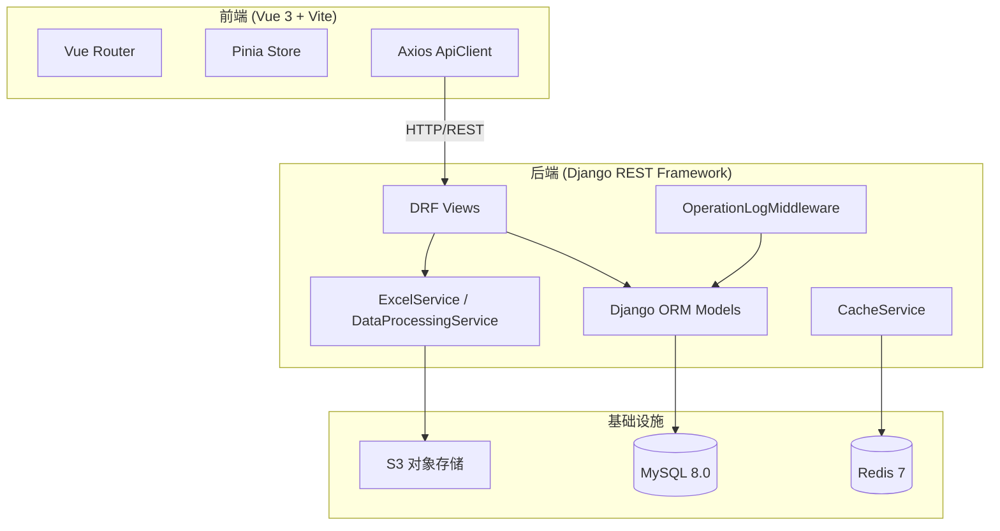
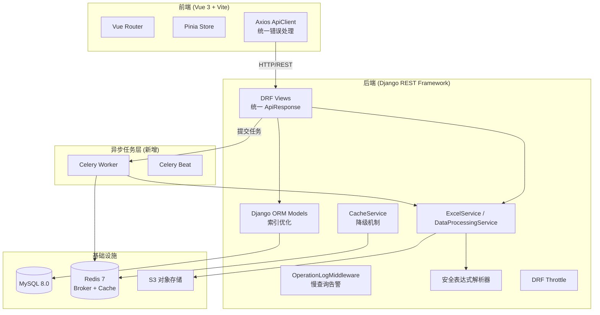

# 技术设计文档：项目分析与优化

## 概述

本设计文档针对数据处理系统（DPS）的 11 项优化需求，提出系统性的技术方案。优化范围涵盖安全加固、性能提升、异步任务、测试体系、API 规范化、前端改进和部署配置等方面。

当前系统架构为 Django REST Framework 后端 + Vue 3 前端的前后端分离架构，使用 MySQL 作为主数据库、Redis 作为缓存和速率限制存储，通过 Docker Compose 编排部署。

本设计遵循最小侵入原则，在不改变现有架构的前提下逐步引入改进。

## 架构

### 当前架构



### 优化后架构变更



主要架构变更：
1. 新增 Celery 异步任务层，使用 Redis 作为 Broker
2. 后端引入安全表达式解析器替代 `eval()`
3. 后端统一使用 `ApiResponse` 响应格式
4. 前端 ApiClient 增加统一错误处理
5. 模型层添加数据库索引优化
6. 中间件增加慢查询告警能力

## 组件与接口

### 需求 1：消除硬编码敏感信息

**组件：环境配置管理**

- 将 `.env` 加入 `.gitignore`，仅保留 `.env.example` 作为模板
- `settings.py` 中 `SECRET_KEY` 改为无默认值，未配置时抛出 `ImproperlyConfigured`
- `UserAdminSerializer.create()` 中默认密码改为 `secrets.token_urlsafe(12)` 生成随机密码
- `docker-compose.yml` 中移除所有默认明文密码，改为必须通过 `.env` 文件或 Docker Secrets 注入

```python
# settings.py 改动
SECRET_KEY = os.getenv('DJANGO_SECRET_KEY')
if not SECRET_KEY:
    raise ImproperlyConfigured('DJANGO_SECRET_KEY 环境变量未配置')
```

### 需求 2：加固后端安全防护

**组件 2.1：文件上传校验**

在 `FileUploadSerializer` 中添加文件类型和大小校验：

```python
ALLOWED_EXTENSIONS = {'xlsx', 'xls', 'csv'}
MAX_FILE_SIZE = 50 * 1024 * 1024  # 50MB

def validate_file(self, value):
    ext = value.name.rsplit('.', 1)[-1].lower() if '.' in value.name else ''
    if ext not in ALLOWED_EXTENSIONS:
        raise serializers.ValidationError(f'不支持的文件类型: {ext}')
    if value.size > MAX_FILE_SIZE:
        raise serializers.ValidationError('文件大小不能超过 50MB')
    return value
```

**组件 2.2：安全表达式解析器**

新建 `backend/utils/safe_eval.py`，使用 AST 解析替代 `eval()`：

```python
import ast
import operator

SAFE_OPS = {
    ast.Add: operator.add,
    ast.Sub: operator.sub,
    ast.Mult: operator.mul,
    ast.Div: operator.truediv,
}

def safe_eval_expr(expr: str) -> float | int | None:
    """安全计算数学表达式，仅允许 +, -, *, / 和数字"""
    try:
        tree = ast.parse(expr, mode='eval')
        return _eval_node(tree.body)
    except Exception:
        return None

def _eval_node(node):
    if isinstance(node, ast.Constant) and isinstance(node.value, (int, float)):
        return node.value
    if isinstance(node, ast.BinOp):
        op_func = SAFE_OPS.get(type(node.op))
        if op_func is None:
            raise ValueError(f'不支持的运算符: {type(node.op).__name__}')
        left = _eval_node(node.left)
        right = _eval_node(node.right)
        if isinstance(node.op, ast.Div) and right == 0:
            raise ZeroDivisionError('除零错误')
        return op_func(left, right)
    if isinstance(node, ast.UnaryOp) and isinstance(node.op, ast.USub):
        return -_eval_node(node.operand)
    raise ValueError(f'不支持的表达式节点: {type(node).__name__}')
```

**组件 2.3：HTTPS 安全设置**

在 `settings.py` 中根据 `DEBUG` 状态条件启用：

```python
if not DEBUG:
    SECURE_SSL_REDIRECT = True
    SECURE_HSTS_SECONDS = 31536000
    SESSION_COOKIE_SECURE = True
    CSRF_COOKIE_SECURE = True
    SECURE_PROXY_SSL_HEADER = ('HTTP_X_FORWARDED_PROTO', 'https')
```

**组件 2.4：速率限制**

在 `REST_FRAMEWORK` 配置中添加全局 Throttle：

```python
REST_FRAMEWORK = {
    ...
    'DEFAULT_THROTTLE_CLASSES': [
        'rest_framework.throttling.AnonRateThrottle',
        'rest_framework.throttling.UserRateThrottle',
    ],
    'DEFAULT_THROTTLE_RATES': {
        'anon': '60/minute',
        'user': '200/minute',
    },
}
```

注册接口单独配置 `ScopedRateThrottle`，限制每 IP 每小时 10 次。

### 需求 3：异步任务执行

**组件：Celery 集成**

新增依赖：`celery[redis]>=5.3,<6.0`

新建 `backend/config/celery.py`：

```python
import os
from celery import Celery

os.environ.setdefault('DJANGO_SETTINGS_MODULE', 'config.settings')
app = Celery('dps')
app.config_from_object('django.conf:settings', namespace='CELERY')
app.autodiscover_tasks()
```

新建 `backend/apps/processing/tasks.py`：

```python
from config.celery import app
from .services import DataProcessingService
from .models import ProcessingTask

@app.task(bind=True, max_retries=0)
def execute_processing_task(self, task_id: int):
    task = ProcessingTask.objects.get(id=task_id)
    task.celery_task_id = self.request.id
    task.save(update_fields=['celery_task_id'])
    DataProcessingService.execute_task(task)
```

`ProcessingTask` 模型新增字段：
- `celery_task_id = CharField(max_length=255, blank=True)` — 用于 revoke 终止

`ProcessingTaskViewSet.execute` 改为：
```python
from .tasks import execute_processing_task

def execute(self, request, pk=None):
    task = self.get_object()
    if task.status not in ['pending', 'failed']:
        return ApiResponse.error('任务状态不允许执行')
    task.status = 'pending'
    task.save(update_fields=['status'])
    execute_processing_task.delay(task.id)
    return ApiResponse.success({'task_id': task.id}, '任务已提交')
```

终止任务改为通过 `app.control.revoke(task.celery_task_id, terminate=True)` 实现。

### 需求 4：数据库索引优化

**模型索引变更：**

```python
# ProcessingTask.Meta
class Meta:
    indexes = [
        models.Index(fields=['status', 'created_by']),
        models.Index(fields=['created_at']),
    ]

# DataMapping.Meta
class Meta:
    indexes = [
        models.Index(fields=['status', 'created_by']),
    ]

# File.Meta
class Meta:
    indexes = [
        models.Index(fields=['status', 'file_type']),
    ]

# LoginLog.Meta — 复合索引
class Meta:
    indexes = [
        models.Index(fields=['created_at', 'status']),
    ]

# OperationLog.Meta — 复合索引
class Meta:
    indexes = [
        models.Index(fields=['created_at', 'module']),
    ]
```

**N+1 查询修复：**

`FileCategorySerializer` 改用 `annotate`：

```python
class FileCategoryViewSet(viewsets.ModelViewSet):
    def get_queryset(self):
        return FileCategory.objects.annotate(
            children_count=Count('children'),
            files_count=Count('files', filter=Q(files__status='active'))
        )
```

Serializer 改为直接读取注解字段：
```python
children_count = serializers.IntegerField(read_only=True)
files_count = serializers.IntegerField(read_only=True)
```

### 需求 5：自动化测试体系

**测试框架：** pytest + pytest-django + pytest-cov

新增依赖：
```
pytest>=8.0,<9.0
pytest-django>=4.8,<5.0
pytest-cov>=5.0,<6.0
hypothesis>=6.100,<7.0
```

**测试文件结构：**
```
backend/
  tests/
    conftest.py          # 共享 fixtures
    test_excel_service.py
    test_expression_eval.py
    test_process_row.py
    test_auth_flow.py
    test_file_upload.py
```

**pytest 配置** (`backend/pytest.ini`)：
```ini
[pytest]
DJANGO_SETTINGS_MODULE = config.settings
python_files = tests/test_*.py
python_classes = Test*
python_functions = test_*
addopts = --cov=apps --cov-report=term-missing --cov-fail-under=70
```

### 需求 6：统一 API 响应格式

**变更范围：**

- `UserViewSet` 的 `list`、`create`、`update`、`destroy`、`roles` 方法全部改用 `ApiResponse`
- `RegisterView.create` 改用 `ApiResponse.created`
- `LoginView.post` 改用 `ApiResponse.success` / `ApiResponse.error`
- `LogoutView.post` 改用 `ApiResponse.success`
- `UserProfileView` 改用 `ApiResponse.success`
- `ChangePasswordView` 改用 `ApiResponse.success` / `ApiResponse.error`
- 移除 `UserListView`，其路由指向 `UserViewSet.list`

### 需求 7：前端错误处理

**ApiClient 响应拦截器增强：**

```typescript
// client.ts 响应拦截器中增加错误分类处理
apiClient.interceptors.response.use(
  (response) => response,
  async (error) => {
    if (error.code === 'ECONNABORTED' || !error.response) {
      message.error('网络连接超时，请检查网络后重试')
      return Promise.reject(error)
    }
    const status = error.response?.status
    switch (status) {
      case 403:
        message.error('权限不足，请联系管理员')
        break
      case 500:
        message.error('服务器异常，请稍后重试')
        break
    }
    // ... 现有 401 处理逻辑
  }
)
```

**新增 403 页面：** `frontend/src/views/Forbidden.vue`

路由守卫中权限不足时跳转到 `/403` 而非 Dashboard。

**任务进度组件：** 在任务执行页面添加轮询进度接口，显示进度条。

### 需求 8：前端安全机制

**Token 存储迁移：**

将 `sessionStorage` 改为内存存储（Pinia reactive state），仅在 Token 刷新时通过 HttpOnly Cookie 传递 refresh token。

方案：
1. `accessToken` 存储在 Pinia store 的内存变量中（页面刷新后丢失）
2. `refreshToken` 通过后端 `Set-Cookie: HttpOnly; Secure; SameSite=Strict` 设置
3. 后端 Token 刷新接口从 Cookie 中读取 refresh token
4. 前端移除 `sessionStorage` 中的 token 存储

**Nginx CSP 头：**

```nginx
add_header Content-Security-Policy "default-src 'self'; script-src 'self'; style-src 'self' 'unsafe-inline'; img-src 'self' data: blob:; connect-src 'self';" always;
```

### 需求 9：Docker 部署优化

**docker-compose.yml 变更：**
- MySQL 和 Redis 移除 `ports` 映射
- Backend 添加 `healthcheck`
- 所有服务添加 `deploy.resources.limits`

**Backend Dockerfile 变更：**
```dockerfile
RUN useradd -m appuser
USER appuser
```

**Nginx 配置变更：**
```nginx
location /admin/ {
    allow 127.0.0.1;
    allow 10.0.0.0/8;
    deny all;
    proxy_pass http://backend:8000;
    ...
}
```

### 需求 10：日志与监控

**结构化日志：**

在 `settings.py` 中配置 JSON 格式日志：

```python
'formatters': {
    'json': {
        '()': 'pythonjsonlogger.jsonlogger.JsonFormatter',
        'format': '%(asctime)s %(levelname)s %(name)s %(message)s',
    },
},
```

新增依赖：`python-json-logger>=2.0,<3.0`

**DataProcessingService 结构化日志：**

```python
logger.info("任务行处理", extra={
    'task_id': task.id,
    'mapping_id': task.mapping_id,
    'row_index': row_idx,
    'duration_ms': duration,
})
```

**慢查询告警：**

`OperationLogMiddleware` 扩展为同时记录 GET 请求中响应时间 > 3s 的慢查询：

```python
if response_time > 3000:
    logger.warning("慢查询告警", extra={
        'path': request.path,
        'method': request.method,
        'duration_ms': response_time,
        'user_id': request.user.id if request.user.is_authenticated else None,
    })
```

**Redis 降级：**

`CacheService` 的 `get`/`set` 方法添加 try-except，Redis 不可用时降级为无缓存模式：

```python
@staticmethod
def get(key: str):
    try:
        return cache.get(key)
    except Exception as e:
        logger.error(f"Redis 读取失败，降级为无缓存: {e}")
        return None
```

### 需求 11：前端构建优化

**xlsx 动态导入：**

在数据处理页面中将 `import * as XLSX from 'xlsx'` 改为：
```typescript
const XLSX = await import('xlsx')
```

**Vite 配置优化：**

```typescript
build: {
    chunkSizeWarningLimit: 500,
    rollupOptions: {
        output: {
            manualChunks: {
                'ant-design-vue': ['ant-design-vue', '@ant-design/icons-vue'],
                'vue-vendor': ['vue', 'vue-router', 'pinia'],
                'xlsx': ['xlsx'],
            },
        },
    },
},
```

**可复用 Composable：**

新建 `frontend/src/composables/useTable.ts`：
```typescript
export function useTable(options: TableOptions) {
    const pagination = reactive({ current: 1, pageSize: 10, total: 0 })
    const loading = ref(false)
    // ... 通用表格逻辑
    return { pagination, loading, handleTableChange }
}
```


## 数据模型

### 模型变更汇总

**ProcessingTask 新增字段：**
| 字段 | 类型 | 说明 |
|------|------|------|
| `celery_task_id` | CharField(255) | Celery 任务 ID，用于 revoke |

**索引变更：**
| 模型 | 索引字段 | 类型 |
|------|----------|------|
| ProcessingTask | (status, created_by) | 复合索引 |
| ProcessingTask | (created_at,) | 单字段索引 |
| DataMapping | (status, created_by) | 复合索引 |
| File | (status, file_type) | 复合索引 |
| LoginLog | (created_at, status) | 复合索引 |
| OperationLog | (created_at, module) | 复合索引 |

### 新增文件

| 文件路径 | 说明 |
|----------|------|
| `backend/utils/safe_eval.py` | 安全数学表达式解析器 |
| `backend/config/celery.py` | Celery 应用配置 |
| `backend/config/__init__.py` | 添加 Celery app 导入 |
| `backend/apps/processing/tasks.py` | Celery 异步任务定义 |
| `backend/tests/conftest.py` | pytest 共享 fixtures |
| `backend/tests/test_*.py` | 各模块测试文件 |
| `backend/pytest.ini` | pytest 配置 |
| `frontend/src/views/Forbidden.vue` | 403 权限不足页面 |
| `frontend/src/composables/useTable.ts` | 通用表格 composable |

## 正确性属性

*正确性属性是在系统所有有效执行中都应成立的特征或行为——本质上是关于系统应该做什么的形式化陈述。属性是人类可读规范与机器可验证正确性保证之间的桥梁。*

### Property 1: 随机密码生成不使用硬编码值

*For any* 用户创建请求（不包含密码字段），通过 `UserAdminSerializer` 创建的用户，其密码哈希不应与硬编码密码 `123456` 的哈希匹配，且生成的密码长度应满足最小长度要求。

**Validates: Requirements 1.2**

### Property 2: 文件类型白名单校验

*For any* 文件名字符串，文件上传验证应当且仅当文件扩展名（不区分大小写）属于 `{xlsx, xls, csv}` 时通过校验，其他所有扩展名（包括空扩展名、双扩展名如 `.py.xlsx` 等）应被拒绝。

**Validates: Requirements 2.1**

### Property 3: 安全表达式解析器等价性

*For any* 由数字和四则运算符（+、-、*、/）组成的合法数学表达式，`safe_eval_expr` 的计算结果应与 Python 内置 `eval()` 的结果一致（在浮点精度范围内）。对于包含非法操作（函数调用、变量引用、import 等）的表达式，`safe_eval_expr` 应返回 `None`。

**Validates: Requirements 2.3**

### Property 4: 任务异常处理完整性

*For any* 在 `DataProcessingService.execute_task` 执行过程中抛出的异常，任务状态应被标记为 `failed`，`error_message` 字段应非空且包含异常信息，`completed_at` 应被设置。

**Validates: Requirements 3.4**

### Property 5: 分类聚合计数一致性

*For any* 文件分类及其关联的子分类和文件集合，通过 `annotate` 查询返回的 `children_count` 和 `files_count` 应与对应的 `obj.children.count()` 和 `obj.files.filter(status='active').count()` 结果完全一致。

**Validates: Requirements 4.4**

### Property 6: Redis 降级容错

*For any* 缓存键和缓存值，当 Redis 连接不可用时，`CacheService.get()` 应返回 `None` 而非抛出异常，`CacheService.set()` 应静默失败而非抛出异常。

**Validates: Requirements 10.5**

## 错误处理

### 后端错误处理策略

| 场景 | 处理方式 | 响应 |
|------|----------|------|
| 文件类型不在白名单 | `ValidationError` | 400 + 错误消息 |
| 文件大小超过 50MB | `ValidationError` | 400 + 错误消息 |
| 表达式包含非法操作 | `safe_eval_expr` 返回 `None` | 字段值为 None |
| 除零错误 | `safe_eval_expr` 捕获 `ZeroDivisionError` | 字段值为 None |
| Celery 任务执行异常 | 捕获异常，标记 `failed` | 任务状态更新 |
| Celery revoke 超时 | 记录警告日志 | 返回终止请求已发送 |
| Redis 连接失败 | 降级为无缓存模式 | 正常响应（无缓存） |
| SECRET_KEY 未配置 | `ImproperlyConfigured` | 启动失败 |
| Token 刷新失败 | 清除认证信息 | 跳转登录页 |
| 注册接口超频 | 429 Too Many Requests | 提示稍后重试 |

### 前端错误处理策略

| HTTP 状态码 | 用户提示 | 附加行为 |
|-------------|----------|----------|
| 网络超时 | "网络连接超时，请检查网络后重试" | 无 |
| 401 | 自动刷新 Token，失败则跳转登录 | 清除存储 |
| 403 | "权限不足，请联系管理员" | 跳转 403 页面 |
| 500 | "服务器异常，请稍后重试" | 无 |

## 测试策略

### 双重测试方法

本项目采用单元测试 + 属性测试的双重测试策略：

- **单元测试（pytest）**：验证具体示例、边界条件和错误场景
- **属性测试（Hypothesis）**：验证跨所有输入的通用属性

### 属性测试配置

- 测试框架：**Hypothesis** (Python PBT 库)
- 每个属性测试最少运行 **100 次迭代**
- 每个属性测试必须通过注释引用设计文档中的属性编号
- 标签格式：`Feature: project-optimization, Property {number}: {property_text}`

### 属性测试清单

| Property | 测试文件 | 测试内容 |
|----------|----------|----------|
| Property 1 | `test_user_creation.py` | 随机密码生成不使用硬编码值 |
| Property 2 | `test_file_validation.py` | 文件类型白名单校验 |
| Property 3 | `test_safe_eval.py` | 安全表达式解析器等价性 |
| Property 4 | `test_task_execution.py` | 任务异常处理完整性 |
| Property 5 | `test_category_annotate.py` | 分类聚合计数一致性 |
| Property 6 | `test_cache_degradation.py` | Redis 降级容错 |

### 单元测试清单

| 模块 | 测试文件 | 覆盖场景 |
|------|----------|----------|
| ExcelService | `test_excel_service.py` | 空文件、单/多 Sheet、无表头 |
| _evaluate_expression | `test_expression_eval.py` | 正常计算、字段引用、除零、非法字符 |
| _process_row | `test_process_row.py` | direct/lookup/computed/default 映射、多值展开 |
| 用户认证 | `test_auth_flow.py` | 登录、登出、Token 刷新 |
| 文件上传 | `test_file_upload.py` | 上传、下载、类型校验、大小限制 |
| API 响应格式 | `test_api_response.py` | 所有端点返回统一格式 |

### 覆盖率要求

- 核心模块（`services.py`、`views.py`）覆盖率 ≥ 70%
- 通过 `pytest-cov` 在 CI 中强制执行
